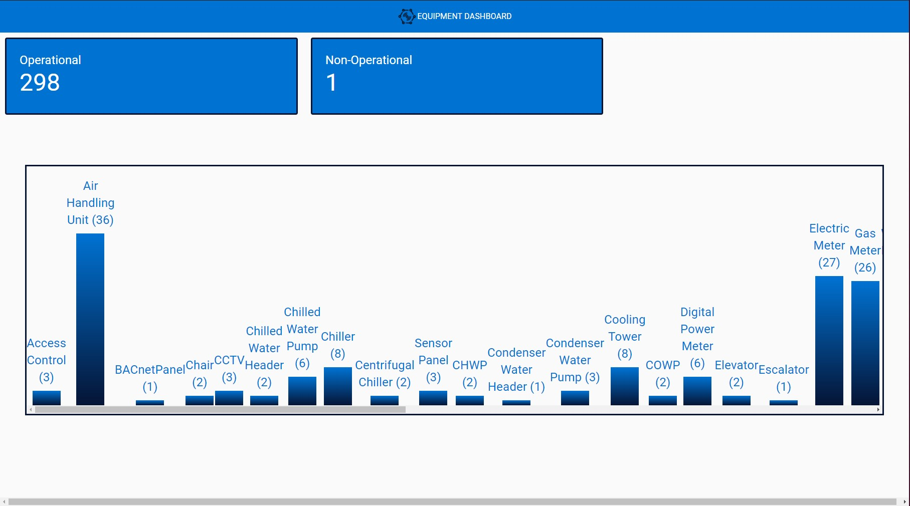

<style>
img {
  background-color: white;
}
</style>

<p align="center">
    
</p>

**Equipment Dashboard**

The dashboard shows the following pieces of information:

1. Number of operational equipment
2. Number of non-operational equipment
3. A column chart where each bar represents an equipment type and the height of the bar
   represents how many equipment of that type are present.

<p align="center">
    
</p>

- [System requirements](#system-requirements)
- [Features](#features)
- [File Structure](#file-structure)
- [Installing](#installing)

## System requirements

- Unix-like OS / Windows;

- Database (MongoDB with no password protection running on 27017 port)

- Node

- Yarn Package Manager

## Features

- Fully responsive mobile view.
- Load data from no CORS enabled server.
- Mirror data to localhost to improve speed (Cache).
- Refresh data stream and continously update DB to monitor operational status of equipment.
- Scalable Node JS server.
- Automated data update on client (every 1 minute).
- Reusable stateless components.

## File Structure

```bash

├── public
├── server
│   ├── api
│   ├── config
│   ├── logger
│   ├── schema
│   └── server.js
└── src
    ├── axios
    ├── components
    ├── pages
    ├── styled-components
    └── App.js

```

- **public** contains all images and icons inculding html

- **server** contains all files for the server connected to the DB

- **src** contains all create-react app files for frontend

- **api** contains api routes for the REST API server

- **config** contains detaild of the MongoDB connection default URL is "mongodb://localhost:27017/test"
- **logger** contains event logic to update the database from the CORS less server
- **schema** contains mongoose schema used to retreive and send data from MongoDB
- **axios** contains axios configuration to call API to the frontend
- **components** contains reusable stateless components
- **pages** stateful components representing pages in the application
- **styled-components** components amped up by styled-components library to produce awsome UI/UX

## Installing

- Go to the server directory `./server`:

```bash
cd .\server\
```

- Install all dependencies for server with yarn

```bash
yarn install
```

- Start server with yarn

```bash
yarn start-server
```

- If Server properly initiated you will get the following log

```bash
$ node server.js
Server running on port 8085
MongoDB is Connected...
```

- Open a new terminal or powershell and go to client directory and install dependecies

```bash
yarn install
```

- Start client (frontEnd).

```bash
yarn start
```

- The webpage will load in http://localhost:3000/

## Technologies

<p align="center">
  
  
  
  
  
  
</p>
